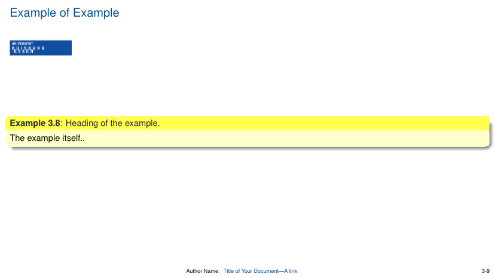
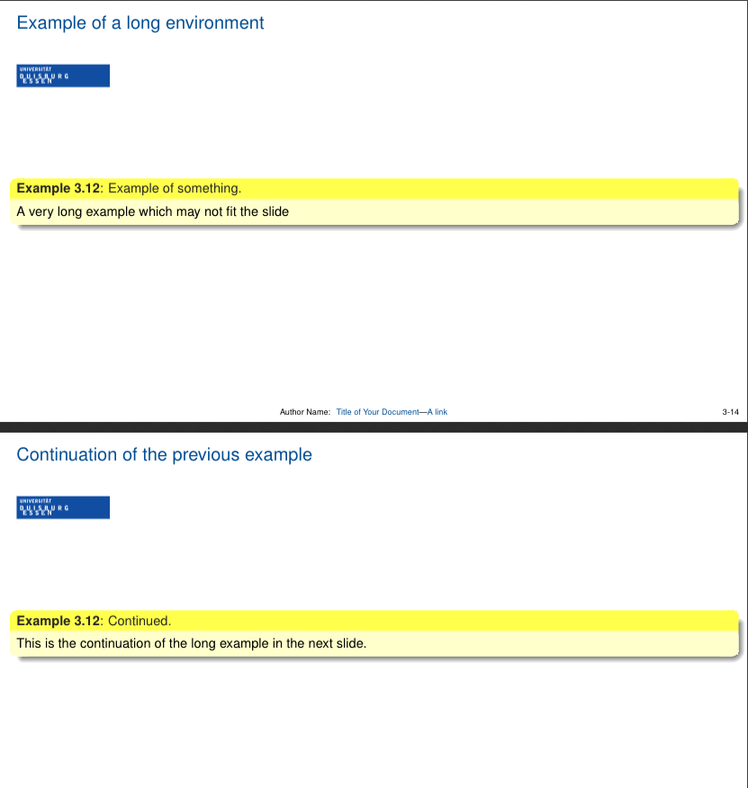
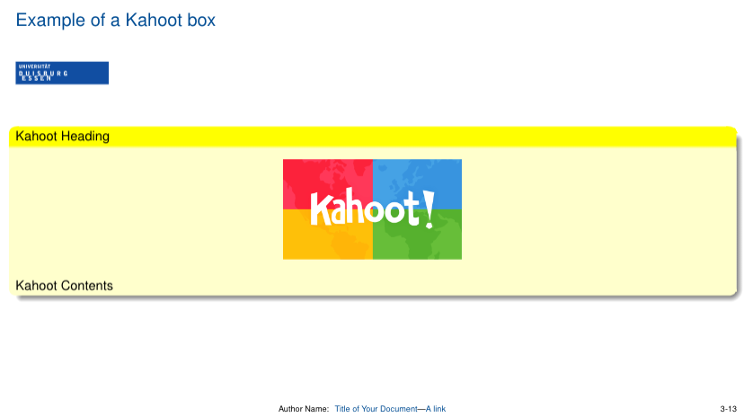
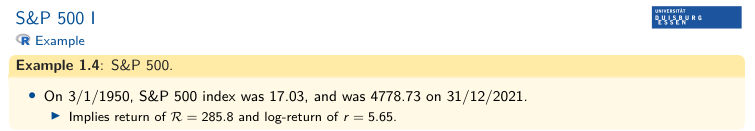
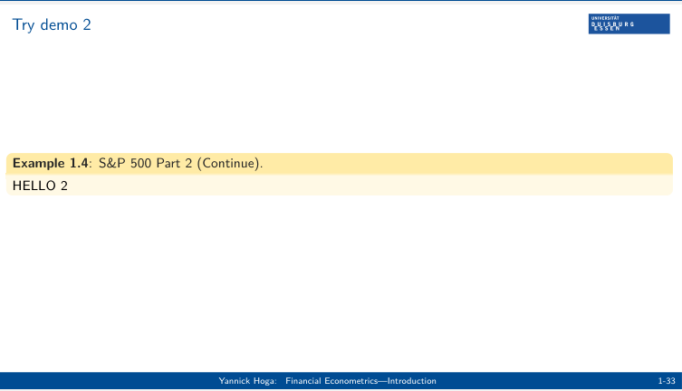
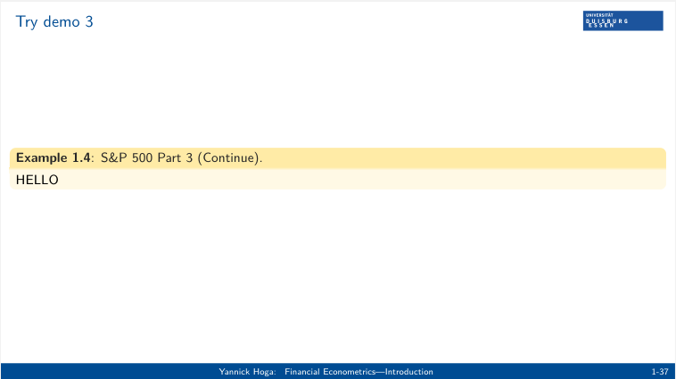

# `runidue`

It is a package in latex used for creating lecture slides. The package contains all codes necessary to knit slides. It has predefined environments for writing lemma, corollary, math formulas, etc. By specifying on the respective YAML header, at the start of the slides, some basic aspects such as font size, aspect ratio, etc, of the slides can be changed.

This readme documentation gives a detailed description, using code snippets and screenshots, on what can be achieved using the unidue package.

# Install the latest development version of *runidue* from GitHub:

```{r}
if (!require("devtools")) {
  install.packages("devtools")
}
devtools::install_github("jens-klenke/runidue")
```

The package can be loaded using:

```{r}
library(runidue)
```
Now the package is loaded and is ready to be used.

# YAML header

A YAML header, also known as YAML front matter, is a section at the beginning of a file written in YAML (YAML Ain't Markup Language) format. It's commonly used in Markdown files (.md) and other types of files to provide metadata or configuration information about the content of the file.

In Markdown files, the YAML header is typically enclosed between triple dashes `- - -` at the beginning and end. Within the YAML header, you can specify key-value pairs separated by colons `:`. These key-value pairs provide information such as title, author, date, tags, etc., depending on the purpose of the file.

A typical YAML header which uses this package looks like:

`````
---
title: "Title"
author: "Author"
date: "Term X"
output: runidue::lectureslides
---
`````

Several modifications to the lecture slides, can be done using the YAML header. To get more information about the specifications, the follwoing code can be used:

```{r}
?runidue::lectureslides
```

An example of a more elaborate YAML header is as follows:

````
---
title: "Title of Your Document"
author: "Author Name"
date: "February 27, 2024"
output: 
  runidue::lectureslides:
    lang: "en"
    theme: "default"
    highlight: "zenburn"
    slide_level: 2
    incremental: true
    colorlinks: true
natbib: true
natbiboptions:
    - "round"
    - "semicolon"
biblio-style: "plainnat"
csl-refs: true
urlcolor: "red"
citecolor: "green"
mainfont: "Times New Roman"
papersize: "a4paper"
fontenc: "T1"
linestretch: 1.2
fontfamily: "times"
toc: true
toc_depth: 2
fontsize: 8pt
classoption: aspectratio=169
link-citations: true 
---
````
In the above YAML header, `title`, `author`, `date`, `output`, `natbib`, `natbiboptions`, `biblio-style`, csl-refs, `urlcolor`, `citecolor`, `mainfont`, `papersize`, `fontenc`, `linestretch`, `fontfamily`, `toc`, `toc_depth`, `fontsize`, and `classoption` are keys specifying different properties of the document. These keys are aligned at the same level. A description of each of the keys are:

| Key | Use |
| ------- | ----------- |
| `title` |  Specifies the title of the document. |
| `author` | Specifies the author(s) of the document. |
| `date` | Specifies the date of the document. |
| `output` | Specifies the output format and options for the document. In our case, the format is specified in lectureslides.tex |
| `biblio-style` | Specifies the bibliography style to be used. |
| `csl-refs` | Specifies whether to use CSL (Citation Style Language) references. |
| `urlcolor` |  Specifies the color for URLs in the document. |
| `citecolor` | Specifies the color for citations in the document. | 
| `mainfont` |  Specifies the main font to be used in the document. |
| `papersize` |  Specifies the size of the paper for the document. |
| `fontenc` | Specifies the font encoding to be used. |
| `linestretch` | Specifies the line spacing for the document. |
| `fontfamily` | Specifies the font family to be used in the document. |
| `toc` |  Specifies whether to include a table of contents in the document. |
| `toc_depth` | Specifies the depth of the table of contents. |
| `fontsize` | Specifies the font size to be used in the document. |
| `classoption` | Specifies additional options for the document class. |
| `link-citations` | Specifies whether you want to use clickable link in the document. |

In the `òutput` key, `runidue::lectureslides` as output option is specified, a further specification used in this YAML header is as follows:

| Sub Key | Use | Example |
| ------- | ----------- | --------------:|
| `lang` |  Specifies the language of the slides. | "en" |
| `theme` | Specifies the theme or style of the slides. | "default" |
| `highlight` | Specifies the syntax highlighting style to be used in code snippets within the slides.  | "zenburn"
| `slide_level` | Specifies the Markdown heading level that should be treated as a new slide. In Markdown, headings are denoted by `#` characters. | "2" |
| `incremental` | This setting enables incremental rendering of slide contents, meaning elements on the slide will appear incrementally, often one after another, as the presenter advances through the slides. This is useful for revealing content step by step during a presentation. | "true" |
| `colorlinks` |  This setting specifies whether links within the slides should be displayed in color. When set to true, links will be colored, providing visual differentiation from regular text. | "true" |

# Environments

Several environments which are predefined in the package, can be called during knitting the files. These environments are used for highlighting Lemma, corollary, proofs, examples, math functions, etc. A comprehensive lists of all such environments which the package offers is as follow:

| Command | Use | Color |
| ------- | ----------- | --------:|
| `thmn` | Theorem | duelightblue |
| `lem` | Lemma | duelightblue |
| `cor` | Corollary | duelightblue |
| `defn` | Definition | duelightblue |
| `ass` | Annahme or Assumption | duelightblue |
| `rem` | Anmerkung or Remark | duelightblue |
| `prop` | Proposition | duelightblue |
| `xmpl` | Beispiel | sandy |
| `que` | Frage or Question | duelightblue |
| `exe` | Aufgabe or Exercise | lightgreen |
| `mthmn` | Mathematical Theorem | duelightblue |

An example of implementation of an environment is as follows: 

```{r}
\xmpl[Heading of the example]
The example itself..
\endxmpl
```

The above environment looks like:



### Long Environments

Sometimes, content of the environment can be enormous and can exceed the limits of slide. In such a case, an environment can be extend or continued over to the next slides. An example of how this can be achieved is as follows:

```{r}
## Example of a long environment
\xmpl[Example of something]
A very long example which may not fit the slide
\endxmpl


## Continuation of the previous example
\xmpl[*]
This is the continuation of the long example in the next slide.
\endxmpl
```

The output is as follows:




By using `\xmpl[*]` the the previous environment can be continued. The usage of `\xmpl[*]` is important as it keeps the numbering of the current environment same as the previous one. 


### Kahoot boxes

Kahoot boxes can be implemented using following code:

```{r}
\kahoot {Kahoot Heading} Kahoot Contents \endkahoot
```

The above implemented Kahoot box looks like:





# An example

[Here](https://github.com/jens-klenke/runidue/blob/development/inst/rmarkdown/templates/lectureslides/skeleton/skeleton.Rmd) an example of implementation of slides using `runidue` package can be seen. The output is [here](https://cyan-conchita-58.tiiny.site). 


# Environments

Several environments which are predefined in the package, can be called during knitting the files. These environments are used for highlighting Lemma, corollary, proofs, examples, math functions, etc. A comprehensive lists of all such environments which the package offers is as follow:

| Command | Use | Default Color |
| ------- | ----------- | --------:|
| `theorem_box_color` | Theorem | duelightblue |
| `lemma_box_color` | Lemma | duelightblue |
| `corollary_box_color` | Corollary | duelightblue |
| `definition_box_color` | Definition | duelightblue |
| `assumption_box_color` | Annahme or Assumption | duelightblue |
| `remark_box_color` | Anmerkung or Remark | duelightblue |
| `proposition_box_color` | Proposition | duelightblue |
| `beispiel_box_color` | Beispiel | sandy |
| `frage_box_color` | Frage or Question | duelightblue |
| `exercise_box_color` | Aufgabe or Exercise | lightgreen |
| `math_theorem_box_color` | Mathematical Theorem | duelightblue |

An example of implementation of an environment is as follows: 

```
--- 
title: "Induktive Statistik"
author: "Prof. Dr. Christoph Hanck"
date: "Sommersemester 2025"
output: 
  runidue::lectureslides:
    lang: "en" 
    keep_tex: true
exercise_box_color: yellow
---
```


# Control Output

Using output.lines now the Output of the R code be controlled. See the below example. For more info refer (https://forum.posit.co/t/showing-only-the-first-few-lines-of-the-results-of-a-code-chunk/6963)

````markdown
 ```{r, output.lines=4}
 summar(model)
 ```
````

# Long Continuation for Example (after several different env in between)

Usage 


### Slide 1

```{r}
## S\&P 500 I

\xmpl[S\&P 500]
\xmpllabel{ex:sp500}{S&P 500 Part 2} # title name for the next slide
\begin{itemize}
  \item On 3/1/1950, S\&P 500 index was 17.03, and was 4778.73 on 31/12/2021.
  \begin{itemize}
    \item Implies return of $\mathcal{R}=285.8$ and log-return of $r=5.65$.
  \end{itemize}
\end{itemize}
\endxmpl
```


NOTE:
The label must be unique (ex:sp500 is just an example).
\xmpllabel{<label>}{<title>} is used only once for that example (on the first part).

### Slide 2

```{r}
## S\&P 500 I

\begin{xmplcontlabel}{ex:sp500}
HELLO 2
\end{xmplcontlabel}
```


NOTE: This will automatically reuse the original number and print the header as S\&P 500 (Continue)


### Slide 3

```{r}
## S\&P 500 I

\begin{xmplcontlabel}[S\&P 500 Part 3]{ex:sp500}
HELLO
\end{xmplcontlabel}
```


NOTE: Use the optional title argument in square brackets. It will have a header as S&P 500 Part 3 (Continue)

